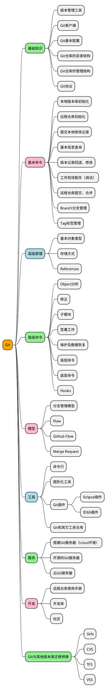
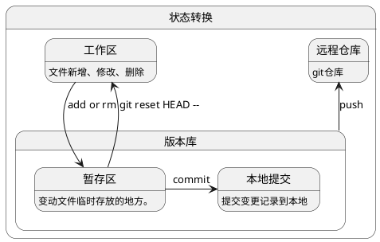

<!-- panels:start -->
<!-- div:title-panel -->
# Git 基本介绍和配置
<!-- div:floating-img -->
![git-logo][git-logo]
<!-- panels:end -->

<details>
    <summary><b>知识体系</b></summary>


</details>

## Git 介绍
&emsp;&emsp;Git是一个分布式版本控制系统,区别于SVN和CVS的集中式版本控制系统。

!> **注意：**所有的版本控制系统只能跟踪文本文件的改动,对于图片、文档、视频等二进制文件没法跟踪文件内容的变化。

### 分布式 VS 集中式

<!-- panels:start -->
<!-- div:left-panel -->
- 集中式版本控制系统 
![集中式版本控制系统][version-control-system-centrailized]
<!-- div:right-panel -->
&emsp;&emsp;像我们所知道的SVN、CVS版本控制系统，版本库是集中存放在中央服务器的，在使用中涉及到文件的获取和提交都需要连网从服务器上获取，提交的时候再把文件推送到中央服务器上。<br>
&emsp;&emsp;集中式版本控制系统一个最大的缺点就是`速度慢而且必须联网`才能使用（在局域网内还好，带宽够大，速度还可以，但是如果在互联网上，遇到网速慢，可能提交一个文件需要很久。）<br>
<!-- panels:end -->

<!-- panels:start -->
<!-- div:left-panel -->
- 分布式版本控制系统
![分布式版本控制系统][version-control-system-distributed]

<!-- div:right-panel -->
&emsp;&emsp;和集中式版本控制系统相比，分布式版本控制系统不需要联网，也不要`中央服务器`，因此它的安全性更高，因为每个用户电脑里都有完整的版本库，可以随时随地进行文件修改并提交，再把修改记录推送给其它用户即可，当某一个用户的电脑坏掉了不要紧，随便从其他人那里复制一个就可以了。而集中式版本控制系统的中央服务器要是出了问题，所有人都没法干活了。<br>
&emsp;&emsp;实际使用过程中，可能应为每个用户间并不在同一局域网或其它原因导致用户的电脑不能访问，不能够及时推送修改记录，这时候需要一台充当`中央服务器`的媒介电脑，每个用户都能进行访问，把各自的修改记录推送到`中央服务器`中，其它用户再与`中央服务器`进行交互即可。这个`中央服务器`仅仅充当用户间彼此交互的媒介。
<!-- panels:end -->

### Git 客户端工具
&emsp;&emsp;常用的Git客户端主要有`msysgit`、`Sourcetree`、`TortoiseGit`，这里主要介绍`windows`环境下的使用。

- msysgit：[https://gitforwindows.org/](https://gitforwindows.org/)
- Sourcetree：[https://www.sourcetreeapp.com/](https://www.sourcetreeapp.com/)
- TortoiseGit：[https://tortoisegit.org/download/](https://tortoisegit.org/download/)

## Git 基本配置
&emsp;&emsp;Git使用前一些基本配置还是需要了解下的，在Git中配置信息按照优先级分为`本地配置-local`、`全局配置-global`、`系统配置-system`。

- **本地配置**<br>
    - 本地配置也就是版本库配置，是当前版本库可用的配置信息，包括远程仓库`URL地址`、`当前分支名`等，在Git使用中`优先级最高`，默认的配置类型，配置参数选项为不填或`--local`。
    - 本地配置对应的配置信息存放在版本库的`.git/config`文件中。

- **全局配置**
    - 全局配置是当前系统登录用户所有版本库通用的配置信息，比如`用户名`、`邮箱`、`命令别名`等。
    - 全局配置对应的配置信息存放在当前用户工作目录下`%USERPROFILE%/.gitconfig`（Windows）或`~/.gitconfig`文件中。

- **系统配置**
    - 系统配置是当前系统所有用户公用的配置信息。
    - 系统配置对应的配置信息存放在Git安装目录下`gitPath/mingw64/etc/gitconfig`文件中。

> [!NOTE]
> 一般情况下我们的配置会选择使用全局配置，也就是使用`git config --global ...`。<br>
> 删除某个配置信息，使用`git config --global unset [configName]`。<br>
> 查看现有配置信息，使用`git config --l`。
    
### 基本信息配置
&emsp;&emsp;基本信息配置主要是配置用户的姓名和邮箱等标识信息。

#### 基本配置
``` bash
#配置全局默认的提交用户名和邮箱
git config [--local | --global | --system] user.name "globalName"  
git config [--local | --global | --system] user.email "globalEmail@email.com"
```
    
#### SSH安全认证登录
&emsp;&emsp;在与`中央服务器`进行交互时，需要进行登录认证操作，除了使用`账户名和密码（Telnet登录协议）`的方式外还可以使用`SSH安全协议`进行远程登录连接。

- **基本配置**
    ``` bash
    #密钥存放目录`[%USERPROFILE% | ~]/.ssh`
    cd ~/.ssh
    #生成密钥对，默认生成的密钥名为`id_rsa`(私钥)、`id_pub`(公钥)，按照步骤操作即可
    #可以指定生成的密钥名称，同时可以设置密码`passphrase`
    ssh-keygen -t rsa -C 'gitStudy@gmail.com'
    INFO:
        $ ssh-keygen -t rsa -C 'gitStudy@gmail.com'
        Generating public/private rsa key pair.
        Enter file in which to save the key (/c/Users/icoder/.ssh/id_rsa): id_rsa
        Enter passphrase (empty for no passphrase):
        Enter same passphrase again:
    #在~/.ssh目录中将`rsa_pub`中的公钥内容复制下来，在`中央服务器`系统中设置`SSH Keys`，内容为`rsa_pub`中的公钥内容
    '中央服务器'->设置->SSH Keys->创建新的SSHKeys时并添加r'rsa_pub'中公钥内容。
    # 配置完成进行SSH连接测试
    ssh -T git@git.com
    ```

### 排除指定文件/文件夹
&emsp;&emsp;有时候在开发过程中，有些临时文件是不需要放在版本库中进行管理的，这时候我们需要将其标记为忽略的文件，在进行版本控制操作时，将不会管理这些忽略的文件。
&emsp;&emsp;Git可以通过配置文件`.gitignore`来配置一些指定文件，在git操作时会自动对这些文件进行忽略。<br>

!> 可以github仓库的[github-gitignore](https://github.com/github/gitignore)文件进行组合成自己需要的

- **基本配置介绍**<br>
&emsp;&emsp;首先可以在工作区的根目录中创建一个`.gitignore`文件，再按照指定规则添加我们需要忽略的文件。
    - 文件中支持部分通配符操作
        - `*`：表示0~多个非`/`字符
        - '?'：表示任意一个非`/`字符
        - `[abc]`：表示其中任意一个字符，如a或b或c
        - `**/xx`：两个前导`*`表示任意路径
        - `xx/**`：两个尾部`*`表示任意路径下的任意文件
        - `!`：表示否定，不包括
        
- **配置需要的`.gitignore`**
    ``` yaml
    *.class
    *.log
    *.jar
    *.war
    .svn

    #Maven
    target
    !**/src/main/**
    !**/src/test/**
    
    #Eclipse
    .classpath
    .project
    .settings

    #IntelliJ IDEA
    .idea
    *.iml

    #VsCode
    .vscode
    ```
    
- **配置全局`.gitignore`**
``` bash
#指定全局忽略文件路径
git config --global core.excludesfile ~/.gitignore
#按照上述配置规则配置~/.gitignore文件，配置结束后可以给本地所有仓库设置忽略规则
```

- 检测文件是否被忽略
``` bash
git check-ignore -v MyClass.class
# .gitignore:1:*.class	MyClass.class
```

### 命令别名配置
&emsp;&emsp;和我一样喜欢使用命令行的同学，经常敲那么多的命令，肯定会想知道一种可以偷懒的方式，简化我们的命令操作，Git中提供了定制命令别名的功能，通过配置别名可以更方便的使用git命令行。

- **别名配置**：`git config [--global | --local | --system] alias.aliasName 'command line'`

- **常用别名配置汇总**，这里使用`--global`全局配置作为示例
    ``` bash
    #查看版本当前状态
    git config --global alias.st status
    #项目clone
    git config --global alias.cl clone
    #切换分支或还原工作目录文件
    git config --global alias.co checkout
    #提交操作
    git config --global alias.c 'commit'
    #提交操作简化提交信息命令
    git config --global alias.cm 'commit -m'
    #自动暂存已修改和删除的文件并提交
    git config --global alias.cam 'commit -am'
    #修改最近一次历史提交信息
    git config --global alias.cad 'commit --amend'
    #分支操作命令
    git config --global alias.br branch
    #创建并切换分支
    git config --global alias.cob 'checkout -b'
    #删除分支命令
    git config --global alias.brD 'branch -D'
    #撤销暂存区内容(撤销add操作)
    git config --global alias.unstage 'reset HEAD --'
    #push版本库提交记录到master分支
    git config --global alias.pom 'push origin master'
    #push版本库提交记录到指定分支
    git config --global alias.po 'push origin'
    # 切换到master主分支
    git config --global alias.master 'checkout master'
    # 日志显示形式
    git config --global alias.lg "log --color --graph --pretty=format:'%Cred%h%Creset -%C(yellow)%d%Creset - %C(bold blue)(%an<%ae>)%Creset - %Cgreen(%ci) %n   %s' --abbrev-commit"
    # 修改记录统计
    git log --pretty=tformat: --numstat | awk '{add += $1; subs+=$2; loc +=$1-$2} END {printf "added lines : %s, remove lines: %s, total lines :%s\n", add, subs, loc}'
    ```

- **复合别名配置**
    ``` bash
    # 将修改或删除的文件添加到暂存区并显示当前工作区状态
    git config --global alias.aust '!git add -u . && git status'
    # 将修改、删除或新增的文件添加到暂存区并显示当前工作区状态
    git config --global alias.ast '!git add . && git status'
    # 将修改、删除或新增的文件添加到暂存区并提交
    git config --global alias.acm '!git add . && git commit -m'
    # 将修改、删除或新增的文件添加到暂存区并提交推送到远程
    git config --global alias.acp '!git add . && git commit && git push'
    ```

### 默认推送行为配置
&emsp;&emsp;Git客户端有默认的针对`git push`的行为配置，在使用`git push`命令没有明确指定本地分支和远程分支时会根据`push.default`的设置进行默认操作。<br>
&emsp;&emsp;一般来说是不需要进行配置的，有需要可以参考如下的配置。

``` bash
#git 2.0版本后默认的推送模式，只有本地分支和远程关联分支`upstream`名称一致才能进行提交
git config --global push.default simple
#不推送任何信息，并提示`You didn't specify any refspecs to push, and push.default is "nothing".`
git config --global push.default nothing
#推送本地分支到远程相同名称的分支（远程分支不存在会创建远程分支）
git config --global push.default current
#推送本地仓库和远程仓库所有名称相同的分支
git config --global push.default machine
#upstream
git config --global push.default upstream
```

## Git 基本使用
&emsp;&emsp;了解了Git的基本配置，现在我们开始使用Git进行工作开发。

### Git 版本库目录结构
&emsp;&emsp;在使用Git前，先了解下Git版本库的基本结构。
<details>
    <summary><b style="color:green">目录结构(点击查看)</b></summary>
    
``` tree
.git
├── config
├── description
├── HEAD
├── hooks
│   ├── applypatch-msg.sample
│   ├── commit-msg.sample
│   ├── fsmonitor-watchman.sample
│   ├── post-update.sample
│   ├── pre-applypatch.sample
│   ├── pre-commit.sample
│   ├── pre-push.sample
│   ├── pre-rebase.sample
│   ├── pre-receive.sample
│   ├── prepare-commit-msg.sample
│   └── update.sample
├── info
│   └── exclude
├── objects
│   ├── info
│   └── pack
└── refs
    ├── heads
    └── tags
```
</details>

### 工作区域和文件状态
&emsp;&emsp;在Git的使用中，一些工作目录和文件状态是需要知道的，Git的工作区域主要有`工作区`、`版本库`和`暂存区`，文件状态有`已修改`、`已暂存`、`已提交`。

#### Git的三个工作区域
- **工作区**<br>
&emsp;&emsp;我们所能看到的代码文件存放目录就是工作区，工作区中进行文件的修改操作，通过`add/rm`添加到暂存区。

- **版本库**<br>
&emsp;&emsp;工作区中有一个隐藏`.git`文件夹，这个就是Git的本地版本库，不属于工作区，版本库中包含了`暂存区`、`HEAD`指针等

- **暂存区（stage）**<br>
&emsp;&emsp;将工作区中的修改内容通过`add/rm`命令就添加到暂存区中了，暂存区中的内容可以通过`git reset HEAD --`命令重新放回工作区。

    > [!TIP]
    > HEAD：指的是当前分支版本头指针位置。

- 提交流程：


#### Git的三种文件状态

- **已修改**
&emsp;&emsp;在工作区中我们进行的文件删除、新增、修改都属于`modified`状态。

- **已暂存**
&emsp;&emsp;使用`git add`操作将文件存放到暂存区的状态都属于`staged`状态。

- **已提交**
&emsp;&emsp;使用`git commit`操作将文件提交到本地版本库的文件都属于`committed`状态。


### 项目检出/新建
&emsp;&emsp;使用Git首先我们需要有Git的版本库，可以新建或者从现有的Git仓库拉取。

- **远程仓库克隆拉取项目版本库**
    ``` bash
    git clone git@git.com/user/repository.git
    ```
        
        
- **新建仓库并关联远程仓库**
    ``` bash
    # 创建工作目录
    mkdir myRepos && cd myRepos;
    # 初始化工作库，初始化结束会在当前文件生成`.git`的隐藏文件夹
    git init .
    # 关联远程仓库地址
    git remote add origin git@git.com/git-learn/myRepos.git
    # 查看已关联的全部远程仓库
    git remote -v
        # origin  git@git.com/git-learn/myRepos.git (fetch)
        # origin  git@git.com/git-learn/myRepos.git (push)
    ```

- **远程仓库管理**
    ``` bash
    #关联远程仓库
    git remote add origin git@git.com/git-learn/myRepos.git
    #查看关联的远程仓库
    git remote -v  
    #移除关联的远程仓库
    git remote remove originName 
    #重命名关联的远程仓库的别名
    git remote rename origin originNew
    #获取关联的远程仓库的URL地址
    git remote get-url origin
    #修改关联的远程仓库的URL地址
    git remote set-url origin
    ```
    

### 开始工作
&emsp;&emsp;版本库已经创建完成，现在开始进行真正的开发使用。

#### 基本操作

<!-- tabs:start -->
##### **文件变动**

- **文件新增/修改**
``` bash
#新增文件`README.md`
echo 'Hello Git!' > README.md
#修改文件
vi add.md
``` 

- **查看工作区状态**
``` bash
#查看工作区
git status
#命令执行输出结果
On branch master // 当前所在分支
No commits yet // 当前版本库没有提交记录
Changes not staged for commit: // 变动文件未添加到暂存区中跟踪
  (use "git add <file>..." to update what will be committed)
  (use "git checkout -- <file>..." to discard changes in working directory) // "git checkout -- <file>..." 放弃当前工作区中文件的改动，还原到暂存区或当前HEAD的文件状态
        modified:   new.md
Untracked files: // 未跟踪的文件列表
    (use "git add ..." to include in what will be committed) // 使用git add 将未跟踪的文件添加到暂存区进行版本管理
        README.md
nothing added to commit but untracked files present (use "git add" to track) // 当前暂存区没有文件变动记录，存在未受版本跟踪的文件
```
> [!NOTE]
> 按照提示可以使用`git add`命令将文件添加到暂存区中进行跟踪

- **添加到暂存区**
    ``` bash
    #添加到暂存区进行跟踪
    git add [README.md | . | *]

    #输出结果
    On branch master
    Changes to be committed:
    (use "git reset HEAD <file>..." to unstage)
            new file:   README.md
    ```
    > [!TIP]
    > `git reset HEAD [file | --]`：还原暂存区中的文件到工作区中。<br>
    > 可以设置个别名`git config --global alias.unstage 'reset HEAD --'`。

- **提交到本地版本库**
    ``` bash
    #将暂存区中跟踪的变更记录提交到本地版本库
    git commit -m 'message description for this commit.'
    ```
    
- **推送本地提交记录到远程仓库**
    ``` bash
    #查看本地版本库状态
    git status

    #结果
    On branch master // 当前所在分支
    Your branch is ahead of 'origin/master' by 2 commits. // 当前本地分支领先于远程分支(本地有未推送到远程的提交记录)
        (use "git push" to publish your local commits) // 使用git push 默认推送到远程相同分支名的分支上
    nothing to commit, working tree clean // 当前暂存区中没有需要追踪的文件记录

    #推送本地提交记录到远程仓库，默认推送到远程相同分支名的分支上
    git push <origin branchName | origin master>
    ```
##### **文件删除/重命名**

- **文件删除**
    ``` bash
    #删除文件
    rm [README.md | file]
    #查看状态
    On branch master
        Changes not staged for commit:
            (use "git add/rm <file>..." to update what will be committed)
            (use "git checkout -- <file>..." to discard changes in working directory)
                    deleted:    README.md
        no changes added to commit (use "git add" and/or "git commit -a")
    #添加到暂存区
    git add .
        On branch master
            Changes to be committed:
            (use "git reset HEAD <file>..." to unstage)
                    deleted:    README.md
    #提交本地版本库&推送远程仓库同文件变动
    ```
- **文件删除并添加到暂存区**
    ``` bash
    #删除文件并添加到暂存区
    git rm [README.md | file]
    #删除文件夹
    git rm -r fileDirector
    #提交本地版本库&推送远程仓库同文件变动
    ```

- **文件重命名**
    ``` bash
    #删除文件
    mv old.md new.md
    #查看工作区状态，可以看到工作区显示删除了原来的文件，并有一个新的文件为跟踪
        On branch master
        Changes not staged for commit:
            (use "git add/rm <file>..." to update what will be committed)
            (use "git checkout -- <file>..." to discard changes in working directory)
                deleted:    old.md
        Untracked files:
            (use "git add <file>..." to include in what will be committed)
                new.md
        no changes added to commit (use "git add" and/or "git commit -a")
    #添加到暂存区
    git add .
    #再次查看工作区状态，git已经为我们进行了合并处理标记为"rename"操作
        On branch master
        Changes to be committed:
            (use "git reset HEAD <file>..." to unstage)
                renamed:    new.md -> newName.md
    ```
- **文件重命名并添加到暂存区**
    ``` bash
    #重命名文件并添加到暂存区
    git mv old.md new.md
    #查看工作区状态
        On branch master
        Changes to be committed:
            (use "git reset HEAD <file>..." to unstage)
                renamed:    new.md -> newName.md
    ```
> [!TIP]
> 这里有几个常用的命令可以关注下：<br>
>       1. 版本库已存在的文件的变动可以使用`git commit -am 'message for this commit'`直接进行添加并提交
>           可以为此设置个命令别名`git config --global alias.cam 'commit -am'`。
>
>       2. 对于未添加到版本库中的文件变动可以使用`git checkout HEAD -- [file | .]`还原文件的修改
>           暂存区存在则还原到暂存区的状态，否则还原到HEAD最新提交时的状态。
> 
>       3. 对于添加到暂存区中的文件可以使用`git reset HEAD [file | --]`将文件还原到工作区中并保留文件的修改变动
>           可以设置个命令别名`git config --global alias.unstage 'reset HEAD --'`
    
    

##### **提交操作**

- **提交相关命令别名**
    ``` bash
    #提交操作
    git config --global alias.c 'commit'
    #提交操作简化提交信息命令
    git config --global alias.cm 'commit -m'
    #自动暂存已修改和删除的文件并提交
    git config --global alias.cam 'commit -am'
    #修改最近一次历史提交信息
    git config --global alias.cad 'commit --amend'
    ```
- **提交操作**：这里直接使用别名进行操作
    ``` bash
    #提交暂存区中的变动记录
    git cm 'commit for update some file.'
    #修改最近一次提交记录的提交信息
    git cad
        #弹出编辑界面,编写后保存并推出即完成最近一次提交信息的修改
    ```

##### **拉取/推送操作**
- **拉取操作**
    ``` bash
    #拉取远程仓库的最新提交，默认拉取当前分支关联的远程分支
    git fetch [origin branchName]
    #拉取远程分支最新提交并合并，等同于`git fetch && git merge`
    git pull [origin branchName]
    #拉取远程分支最新提交并进行变基操作，`git fetch && git rebase`
    git pull [origin branchName] --rebase
    ```
    
- **推送操作**
    ``` bash
    #推送当前分支最近的提交记录到关联的远程仓库同名分支
    git push
    #推送当前分支最近的提交记录到远程仓库的指定分支
    git push origin branchName
    # 推送当前分支指定的提交记录"commitId"到远程分支"branchName"
    git push origin commitId:branchName
    #将当前分支和远端指定分支关联并推送，远端分支则必须和当前分支名称相同,等同"push origin branchName"命令
    git push --set-upstream origin branchName
    ```

##### **文件/分支比较**
&emsp;&emsp;Git中使用`git diff`命令进行文件或者版本间的比较，以文本输出的形式显示差异信息。

- **版本比较操作**
    ``` bash
    #比较工作区和暂存区（如果暂存区没有记录则和最近的一次提交进行比较）
    git diff 
    #比较指定文件/文件夹，如果暂存区不存在则和最近一次提交时的状态进行比较
    git diff [file | directory]
    #比较指定分支
    git diff [branchName]
    #比较指定分支的指定文件或文件夹
    git diff [branchName] [file | directory]
    #和指定commitId的版本进行比较
    git diff [commitId] <branchName> -- <file | directory>
    ```

##### **提交日志**
&emsp;&emsp;使用`git log`可以查看版本库所有的提交日志，默认按照时间先后顺序列出所有的提交。

- **提交日志查看**
    ``` bash
    #查看当前分支全部提交日志，默认展示如下，最近的更新排在最上面
    git log
        commit d4321etbbd4fe5670581bf96c36cbb59d945d966 (HEAD -> master)
        Author: git <git@163.com>
        Date:   Sun Jul 11 11:10:40 2000 +0800
            commit message
    ```
- **常用参数选项**，命令为：`git log` +
    | 选项 | 说明 |
    | :------------- | :------------- |
    | -p 或 --patch         | 按补丁格式显示每个提交引入的差异。    | 
    | **--stat**            | 显示每次提交的文件修改统计信息，包括文件变动列表、文件行数变动和。总的变动信息汇总。  |
    | --branches            | 查看所有分支的提交日志记录 |
    | --shortstat           | 只显示 --stat 中最后的行数修改添加移除统计。  |
    | --name-only           | 仅在提交信息后显示已修改的文件清单。  |
    | --name-status         | 显示新增、修改、删除的文件清单。  |
    | --abbrev-commit       | 仅显示 SHA-1 校验和所有 40 个字符中的前几个字符。 |
    | --relative-date       | 使用较短的相对时间而不是完整格式显示日期（比如“2 weeks ago”）。   |
    | --graph               | 在日志旁以`ASCII`图形显示分支与合并历史。 |
    | --pretty              | 使用其他格式显示历史提交信息。可用的选项包括 oneline、short、full、fuller 和format（用来定义自己的格式）。    |
    | --oneline             |  --pretty=oneline --abbrev-commit 合用的简写。    |
    | branch1..branch2      | 查看在branch2分支上存在，branch1分支不存在的提交日志 |
    | commitId1..commitId2  | 查看提交记录`commitId1`到`commitId2`之间的提交记录包括`commitId2`不包括`commitId1` |

- **过滤相关参数选项**
    | 选项 | 说明 |
    | :------------- | :------------- |
    | -&lt;n&gt;        | n为自然数，仅显示最近的 n 条提交。   |
    | -- &lt;path&gt;   | 显示变动包含指定文件/文件夹的提交日志。   |
    | --since, --after  | 仅显示指定时间之后的提交。 |
    | --until, --before | 仅显示指定时间之前的提交。 |
    | --author=         | 仅显示作者匹配指定字符串的提交。 |
    | --committer=      | 仅显示提交者匹配指定字符串的提交。 |
    | --grep=           | 仅显示提交说明中包含指定字符串的提交。    |
    | --all-match       | 像`--grep`参数选项可以使用多个，满足其一即可，如果要全部满足则添加`--all-match`参数选项。   |
    | -S                | 仅显示添加或删除内容匹配指定字符串的提交。    |
    | --no-merges       | 仅显示未做过合并操作的提交日志。    |
    | -- <path>         | 查看指定文件或文件夹的提交日志，支持`/fileDirector/*`匹配 |
    
- **选项参数详解**
    - `-- stat`：显示每次提交简略统计信息。
        ``` bash
        Author: git <git@163.com>
        Date:   Sun Jul 19 10:11:14 2020 +0800
            update git
        .../version-control/git/git-use-and-config.md      | 25 +++++++++++++++++++++-
        1 file changed, 24 insertions(+), 1 deletion(-)
        ```
    - `--since`：查看从指定时间以后的提交日志
        ``` bash
        #支持多种格式指定，比如`today`、`yesterday`、`yyyy-MM-dd hh:mm:ss`等。
        git log --since='2020-01-01 14:34:43'
        ```
    - `--until`：查看到指定时间之前的提交日志
        ``` bash
        #支持多种格式指定，比如`today`、`yesterday`、`yyyy-MM-dd hh:mm:ss`、`2.weeks`等。
        git log --until='2020-01-01 14:34:43'
        ```
    - `-S`：查看修改信息中包含的关键词
        ``` bash
        #查看提交日志涉及的文件变动中的关键词
        git log -S `echo`
        ```
        
    - <b style="color:red">--pretty=[oneline | short | full | fuller | format]</b>：使用指定的格式信息显示提交日志，尤其是`format`可以定制日志输出格式。
        - `format`常用参数选项
            | 选项 | 说明 |
            | :------------- | :------------- |
            | %H    | 提交的完整哈希值 |
            | %h    | 提交的简写哈希值 | 
            | %T    | 树的完整哈希值   | 
            | %t    | 树的简写哈希值   | 
            | %P    | 父提交的完整哈希值 | 
            | %p    | 父提交的简写哈希值 | 
            | %an   | 作者名字          | 
            | %ae   | 作者的电子邮件地址 | 
            | %ad   | 作者修订日期（可以用 --date=选项 来定制格式） | 
            | %ar   | 作者修订日期，按多久以前的方式显示            | 
            | %cn   | 提交者的名字           | 
            | %ce   | 提交者的电子邮件地址    | 
            | %cd   | 提交日期               | 
            | %cr   | 提交日期（距今多长时间）| 
            | %s    | 提交说明               |
        - `format`使用示例
            ``` bash
            #定制化日志输出信息显示
            git log -1 --pretty=format:'%h - %d - %an<%ae> - %ci %n %s (%cr)'
                65762dd -  (HEAD -> master) - git<git@163.com> - 2020-07-19 00:45:31 +0800
                    Add a new file <README.md> update commit message (10 hours ago)
            ```
<!-- tabs:end -->

#### 分支管理
&emsp;&emsp;Git中分支管理相关的命令选项为`git branch`。

- **常见参数选项**。：`git branch +`
    | 选项     | 说明     |
    | :------------- | :------------- |
    | -l 或 --list                              | 显示本地全部分支列表      |
    | -a 或 --all                               | 查看本地和远程全部分支列表    |
    | -r 或 --remotes                           | 查看远程分支列表  |
    | &lt;name&gt;                              | 创建指定分支`name`  |
    | &lt;name&gt; [origin/bName]               | 基于指定分支创建新的分支`git branch name origin/master`    |
    | -m 或 --move                              | 重命名分支名,`git branch -m oldName newName`  |
    | -d 或 -D                                  | 删除分支`-D`表示强制删除  |
    | ` --unset-upstream`                       | 删除当前分支关联的远程分支 |
    | ` -u | --set-upstream-to=origin/<branch>` | 跟踪指定远程分支，将当前分支与远程分支关联 |


- **其它相关操作**：`git +`
    | 选项 | 说明 |
    | :------------- | :------------- |
    | `push origin :branchName`                 | 删除远程分支  |
    | `push origin :refs/heads/branchName`      | 删除远程分支  |
    | `push --set-upstream origin branchName`   | 将当前分支和远端指定分支关联并推送，远端分支必须和当前分支名称相同<br>等同`push origin branchName`命令 |
    | `checkout branchName`                     | 切换到指定分支    |
    | `checkout -b branchName`                  | 基于当前分支最近一次提交创建新的分支并切换 |
    | `checkout -b branchName [origin/rb 或 lb]`| 基于指定分支(远程和本地)创建新的分支并切换 |

- **远程分支管理**：`git remote +`
    - **常用用法**
    ``` text
    usage:  git remote [-v | --verbose]
        or: git remote add [-t <branch>] [-m <master>] [-f] [--tags | --no-tags] [--mirror=<fetch|push>] <name> <url>
        or: git remote rename <old> <new>
        or: git remote remove <name>
        or: git remote set-head <name> (-a | --auto | -d | --delete | <branch>)
        or: git remote [-v | --verbose] show [-n] <name>
        or: git remote prune [-n | --dry-run] <name>
        or: git remote [-v | --verbose] update [-p | --prune] [(<group> | <remote>)...]
        or: git remote set-branches [--add] <name> <branch>...
        or: git remote get-url [--push] [--all] <name>
        or: git remote set-url [--push] <name> <newurl> [<oldurl>]
        or: git remote set-url --add <name> <newurl>
        or: git remote set-url --delete <name> <url>
    ```

    - **用法说明**
    | 选项 | 说明 |
    | :------------- | :------------- |
    | `-v`                      | 查看关联的远程仓库  |
    | `add origin gitRepoUrl`   | 关联远程仓库  |
    | `rename origin originNew` | 重命名关联的远程仓库的别名 |
    | `remove originName`       | 移除关联的远程仓库 |
    | `get-url origin`          | 获取关联的远程仓库的URL地址    |
    | `set-url origin`          | 修改关联的远程仓库的URL地址 |
    | `show remoteName(origin)` |  查看远程仓库的分支状态 |
    | `[-p | --prune] remoteName(origin) `  | 远程分支清理，比如远程分支删除本地查看仍存在可以使用此命令 |
    
    - **用法详解**
        - **查看远程仓库的分支状态**
            ``` bash
            #查看远程仓库分支状态
            git remote show origin
                * remote origin
                Fetch URL: git@gitlab.com:java/project.git
                Push  URL: git@gitlab.com:java/project.git
                #当前处于master分支
                HEAD branch: master
                #远程分支列表，tracked表示跟踪的分支
                Remote branches:
                    develop            tracked
                    feature/swagger    tracked
                    local-svn          tracked
                    master             tracked
                    release/2020.06.30 tracked
                    deletedBranch      tracked
                #本地分支和远程分支关联状态
                Local branches configured for 'git pull':
                    develop            merges with remote develop
                    feature/swagger    merges with remote feature/swagger
                    master             merges with remote master
                    release/2020.06.30 merges with remote release/2020.06.30
                #本地分支和远程分支关联状态
                Local refs configured for 'git push':
                    develop            pushes to develop            (up to date)
                    feature/swagger    pushes to feature/swagger    (up to date)
                    master             pushes to master             (up to date)
                    release/2020.06.30 pushes to release/2020.06.30 (up to date)
                    deletedBranch      pushes to deletedBranch      (up to date)
            ```
        - **远程分支清理**
            ``` bash
            #删除远程分支deletedBranch
            $ git remote show origin
                * remote origin
                Fetch URL: git@gitlab.com:java/project.git
                Push  URL: git@gitlab.com:java/project.git
                HEAD branch: master
                Remote branches:
                    develop                             tracked
                    feature/swagger                     tracked
                    local-svn                           tracked
                    master                              tracked
                    refs/remotes/origin/deletedBranch   stale (use 'git remote prune' to remove)
                    release/2020.06.30       tracked
                Local branches configured for 'git pull':
                    develop            merges with remote develop
                    feature/swagger    merges with remote feature/swagger
                    master             merges with remote master
                    release/2020.06.30 merges with remote release/2020.06.30
                Local refs configured for 'git push':
                    develop            pushes to develop            (up to date)
                    feature/swagger    pushes to feature/swagger    (up to date)
                    master             pushes to master             (up to date)
                    release/2020.06.30 pushes to release/2020.06.30 (up to date)
            #远程分支删除后看到`refs/remotes/origin/deletedBranch   stale (use 'git remote prune' to remove)`提示信息
            #清理远程分支
            $ git remote prune origin
                Pruning origin
                URL: git@gitlab.com:java/project.git
                * [pruned] origin/deletedBranch
            #再次查看远程仓库分支信息已删除的分支不存在了
                Remote branches:
                        develop                             tracked
                        feature/swagger                     tracked
                        local-svn                           tracked
                        master                              tracked
                        release/2020.06.30       tracked
            ```
            
        


- **分支合并**<br>
&emsp;&emsp;分支合并常用的命令式`merge（合并）`和`rebase（变基）`。

- merge和rebase区别
    - merge操作会生成一条新的提交记录
    - merge操作会合并两个分支的提交记录按照的先后日期排序，而rebase操作会先显示主分支的提交记录再显示当前分支的patch记录。

- **常用操作**
    ``` bash
    #合并指定的远程仓库分支或本地分支到当前分支（在当前分支会生成一条新的提交记录）
    git merge [origin/branchName | branchName] -m 'commit message'
    
    #变基操作合并指定的远程仓库或本地分支到当前分支
    git rebase [origin/branchName | branchName]
    ```
    - **冲突解决**：在进行上述操作过程中，会遇到`conflict`冲突场景。
        ``` bash
        #遇到冲突时，撤销合并操作
        git [rebase | merge] --abort
        #解决完冲突继续合并
        git [rebase | merge] --continue
        ```

        
    

#### 版本管理
- **版本回退和还原**
    ``` bash
    #查看历史提交/回退操作记录
    git reflog -n
    #撤销工作区文件变动,可以使用`-- .`撤销还原工作区所有文件变动
    git checkout -- <file>
    #撤销暂存区中的所有变动或指定文件,还原到工作区中
    git reset HEAD -- [file]
    #撤销指定提交记录的文件变动还原到工作区中,可以使用commitId或上一个版本HEAD^，上上版本就是HEAD^^,HEAD~100
    git reset [HEAD~4 | commitId] -- [file]
    #撤销并还原本地(指定文件或全部)代码记录至最近版本，和`checkout -- .`类似
    git reset --hard [file]
    #回退到指定版本记录只需要撤销操作后添加`--hard`选项即可
    git reset --hard [HEAD~4 | commitId] -- [file]
    ```

#### 。 tag标签
&emsp;&emsp;tag标签一般作为特殊的分支，标示这里程碑阶段，tag标签默认是不允许在当前标签进行修改提交的。
- **常用操作**
    ``` bash
    #给最近的提交commit，默认HEAD打上标签
    git tag v2020.06.03
    #给指定的提交记录打上标签，`a3a45c0`是commit id的前几位
    git tag v 0.0.1 a3a45c0
    #查看标签记录
    git tag [-l | --list]
    #查看指定标签的详细信息，包含打标签者的名字、电子邮件地址、日期时间；还有一个标签信息
    git show tagname
    #创建带有具体说明的标签 `-a指定标签名` `-m指定描述信息`
    git tag -a tagCommit -m desc [a3a45c0-commit_id]
    #删除标签
    git tag -d tagName
    #推送指定标签到远程服务器
    git push origin [tag] tagName
    #推送全部未推送过的本地标签到远程服务器
    git push origin --tag
    #删除远程仓库标签
    git push origin :tagName 
    git push origin :refs/tags/tagname
    ```

#### 工作现场存储
&emsp;&emsp;在我们平时编码开发过程中，可能需要进行功能调试，需要暂时还原我们正在编写的代码，这时候就需要暂时将我们改动的代码进行存储起来。

- **常用操作**
    ``` bash
    #首先需要将我们改动的文件存放在暂存区
    git add .
    #将已在暂存区的文件新的修改添加到暂存区，忽略未添加到暂存区的文件
    git add -u
    #暂存工作现场并将代码进行还原
    git stash
    #代码调试结束,将工作现场还原
    git stash apply
    #还原工作现场并删除存储的工作现场
    git stash pop
    #查看存储的工作现场
    git stash list
    #删除存储的工作现场,删除最近存储的一个工作现场
    git stash drop
    #清除全部存储的工作现场
    git stash clear
    ```
### 实践操作    

#### 冲突解决

- **冲突类型**
    - 逻辑冲突：逻辑冲突一般是文件增删或者代码逻辑变动导致的非检查冲突类型，这种冲突在进行代码同步合并提交时很难自动检查出来。
        1. 远程代码文件删除，本地代码仍在使用，冲突会自动合并解决，但是对于代码逻辑上存在逻辑问题。
        2. 代码文件方法逻辑变动，但是本地代码仍在使用原有逻辑，此时会自动完成合并提交，但是远程仓库中的代码是存在逻辑漏洞的，可能会产生意料之外的BUG。
    - 内容冲突：内容冲突是我们在使用过程中最常见的冲突。
        1. 多用户对同一文件进行修改提交。
        2. 不同分支进行合并时同一文件在不同分支上均有变动，合并时会长生内容冲突。
    - 树冲突：当多个用户对同一文件进行重命名时，可能发生树冲突，比如用户A将文件DOC.txt重命名为DOC1.txt，用户B将文件DOC.txt重命名为DOC2.txt，在进行代码合并提交时则
        
#### 交互式变基


<!-- 资源链接 -->
[git-logo]: /docs/assets/images/git/git-logo.png 'git'
[version-control-system-centrailized]: /docs/assets/images/git/version-control-system-centrailized.png '集中式版本控制系统'
[version-control-system-distributed]: /docs/assets/images/git/version-control-system-distributed.png '分布式版本控制系统'
