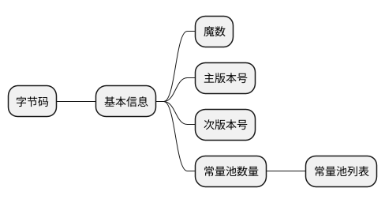

# 💻 Java 虚拟机 :id=jvm

## 1. 👁 概念基础 :id=jvm-basic

### 1.1. Java 虚拟机 :id=java-virtual-machine

`JVM（Java Virtual Machine）`虚拟机是一个应用程序，提供了运行 Java 程序所需的运行时环境。如果某个硬件和操作系统平台没有相应的 JVM，就不能运行 Java 程序。
执行`java <arguments> <program name>` 命令会在操作系统的一个进程中启动 JVM。

- `JVM`虚拟机提供了什么用处？

  1. 提供一个容器，让应用程序代码运行在其中；
  2. 较`C/C++`，提供了一个安全的执行环境；
  3. 帮助代开发者管理内存；
  4. 提供一个跨平台的执行环境;
  5. JVM 使用运行时信息进行自我管理。

### 1.2. 🏖️ JDK, JRE, JVM

- JVM
  - Java 虚拟机编译 Java 源文件生成中间字节码问题
  - 加载解析字节码文件,调用系统相关 API 解释执行字节码数据流中对应的字节码指令
  - 为不同平台提供支持,使得 Java 语言的具有跨平台的特性
- JRE
  - Java Runtime Environment, 包括了 JVM 虚拟机的标准实现和相关类库
- JDK
  - Java Develop Kit, Java 开发工具套件, 包括了 JRE 运行时环境和相关的一些工具支持

### 1.3. 🛠️ JDK 常用工具

#### 1.3.1. jps

查看环境中运行的 java 进程

#### 1.3.2. jinfo

配置信息: 环境属性, VM 启动参数

#### 1.3.3. jstate

?> jstack 实用工具用于输出进程中每个 Java 线程的堆栈跟踪，生成虚拟机当前时刻的线程快照（threaddump 或 javacore 文件）

- 用法：

```text
Usage:
    jstack [-l] <pid>
        (to connect to running process)
    jstack -F [-m] [-l] <pid>
        (to connect to a hung process)
    jstack [-m] [-l] <executable> <core>
        (to connect to a core file)
    jstack [-m] [-l] [server_id@]<remote server IP or hostname>
        (to connect to a remote debug server)

Options:
    -F  强制线程转储。当jstack <pid>不响应（进程已挂起）时使用
    -m  打印Java和本地方法（C/C++）的堆栈（混合模式）
    -l  长模式。除了堆栈外打印有关锁的其他信息
    -h or -help to print this help message
```

!> 生成堆栈跟踪时不会停止或终止 Java 进程。 jstack 生成的文件可能很大，经常需要做后续处理。

#### 1.3.4. jmap

?> Java 内存映射工具(Java Memory Map)，主要用于打印指定 Java 进程、核心文件或远程调试服务器的共享对象内存映射或堆内存细节。

- 用法

```text
Usage:
    jmap [option] <pid>
        (to connect to running process)
    jmap [option] <executable <core>
        (to connect to a core file)
    jmap [option] [server_id@]<remote server IP or hostname>
        (to connect to remote debug server)

where <option> is one of:
    <none>               to print same info as Solaris pmap
    -heap                显示堆详细信息
    -histo[:live]        打印Java对象堆的直方图；如果指定了“活动”子选项，则仅计算活动对象
    -clstats             打印类加载器统计信息
    -finalizerinfo       在等待完成的对象上打印信息
    -dump:<dump-options> to dump java heap in hprof binary format
                         dump-options:
                           live         dump only live objects; if not specified,
                                        all objects in the heap are dumped.
                           format=b     binary format
                           file=<file>  dump heap to <file>
                         Example: jmap -dump:live,format=b,file=heap.bin <pid>
    -F                   force. Use with -dump:<dump-options> <pid> or -histo
                         to force a heap dump or histogram when <pid> does not
                         respond. The "live" suboption is not supported
                         in this mode.
    -h | -help           to print this help message
    -J<flag>             to pass <flag> directly to the runtime system
```

- 示例

?> jmap -dump:format=b,file=<dumpfile.hprof> <pid>

### 1.4. 字节码规范

#### 1.4.1. 字节码结构



### 1.5. 虚拟机规范

#### 1.5.1. 原始类型与值

- 整数类型与值

  - byte：-128~127
  - short： -32768~32767
  - int：-2^31~2^31-1
  - long：-2^63~2^63-1
  - char：0~65535

- 浮点型

  - float
  - double

- returnAddress
  - jsr、ret、jsr_w

#### 1.5.2. 引用类型

- 类类型
- 接口类型
- 数组

#### 1.5.3. 堆和栈有什么区别

- 软件设计的角度看，栈代表了处理逻辑，而堆代表了数据。
- 堆与栈的分离，使得堆中的内容可以被多个栈共享。
- 栈因为运行时的需要，比如保存系统运行的上下文，需要进行地址段的划分。由于栈只能向上增长，因此就会限制住栈存储内容的能力。
  而堆不同，堆中的对象是可以根据需要动态增长的，因此栈和堆的拆分，使得动态增长成为可能，相应栈中只需记录堆中的一个地址即可。
- 面向对象就是堆和栈的完美结合。对象的属性其实就是数据，存放在堆中；而对象的行为（方法），就是运行逻辑，放在栈中。

## 2. 类加载子系统

jvm 中，确定一个类的唯一性是依赖于加载这个类的类加载器和这个类本身的。只有加载类的类加载器和类本身两者都一致，jvm 才会认为这个类是唯一的。

### 2.1. 类加载器的分类

- JVM 层面分类

  - 启动类加载器（Bootstrap ClassLoader）,由 C++语言实现，属于 JVM 内部。
  - 其他的类加载器,由 java 语言编写，属于 JVM 外部，全部继承于抽象类 java.lang.ClassLoader

- Java 层面分类
  - 启动类加载器（Bootstrap ClassLoader）;
  - 扩展类加载器（Extension ClassLoader）:负责加载<JAVA_HOME>\lib\ext 目录中的，或者被 java.ext.dirs 系统变量所指定的路径下的类库。
  - 应用程序加载器（Application ClassLoader）:该加载器是 ClassLoader 中的 getSystemClassLoader()方法的返回值，一般也称为系统类加载器,负责加载用户类路径 CLASSPATH 所指定的类库。

### 2.2. JVM 中类加载机制

JVM 中类的装载主要是由`ClassLoader`及其子类来实现的。
`ClassLoader`是负责在运行时查找和装入类文件的类，

### 2.3. 双亲(父亲)委派机制

java 中存在 3 种类型的类加载器：引导类加载器，扩展类加载器和系统类加载器。三者是的关系是：引导类加载器是扩展类加载器的父类，扩展类加载器是系统类加载器的父类。

- **引导类加载器（Bootstrap）**
  主要负责加载 jvm 自身所需要的类，该加载器由 C++实现，加载的是 <JAVA_HOME>/lib 下的 class 文件，或 -Xbootclasspath 参数指定的路径下的 jar 包加载到内存中，注意必由于虚拟机是按照文件名识别加载 jar 包的，如 rt.jar，如果文件名不被虚拟机识别，即使把 jar 包丢到 lib 目录下也是没有作用的(出于安全考虑，Bootstrap 启动类加载器只加载包名为 java、javax、sun 等开头的类。

- **拓展类加载器(Extension)**
  扩展类加载器是指 Sun 公司(已被 Oracle 收购)实现的 sun.misc.Launcher\$ExtClassLoader 类，由 Java 语言实现的，是 Launcher 的静态内部类，它负责加载 <JAVA_HOME>/lib/ext 目录下或者由系统变量 -Djava.ext.dir 指定位路径中的类库，开发者可以直接使用标准扩展类加载器。

- **系统类加载器（Application）**
  也称应用程序加载器是指 Sun 公司实现的 sun.misc.Launcher\$AppClassLoader 。它负责加载系统类路径 java -classpath 或 -D java.class.path 指定路径下的类库，也就是我们经常用到的 classpath 路径，开发者可以直接使用系统类加载器，一般情况下该类加载是程序中默认的类加载器，通过 ClassLoade.getSystemClassLoader() 方法可以获取到该类加载器

### 2.4. 双亲委派模型的工作过程是

如果一个类加载器收到了类加载的请求，他首先不会自己去尝试加载这个类，而是把这个请求委派父类加载器去完成。每一个层次的类加载器都是如此，因此所有的加载请求最终都应该传送到顶层的启动类加载器中，只有当父加载器反馈自己无法完成这个请求（他的搜索范围中没有找到所需的类）时，子加载器才会尝试自己去加载。

### 2.5. 为什么使用双亲委派机制

在 Java 的日常应用程序开发中，类的加载几乎是由上述 3 种类加载器相互配合执行的，在必要时，我们还可以自定义类加载器，需要注意的是，Java 虚拟机对 class 文件采用的是按需加载的方式，也就是说当需要使用该类时才会将它的 class 文件加载到内存生成 class 对象，而且加载某个类的 class 文件时，Java 虚拟机采用的是双亲委派模式即把请求交由父类处理，它一种任务委派模式。

- **JVM 中如何判断两个对象属于同一个类**
  - 用同名的类完成实例化的；
  - 两个实例各自对应的同名的类的加载器必须是同一个。比如两个相同名字的类，一个是用系统加载器加载的，一个扩展类加载器加载的，两个类生成的对象将被 jvm 认定为不同类型的对象。
- **目的**
  防止重复加载同一个 .class 。通过委托去向上面问一问，加载过了，就不用再加载一遍。保证数据安全。
  为了系统类的安全，类似“ java.lang.Object”这种核心类，jvm 需要保证他们生成的对象都会被认定为同一种类型。即“通过代理模式，对于 Java 核心库的类的加载工作由引导类加载器来统一完成，保证了 Java 应用所使用的都是同一个版本的 Java 核心库的类，是互相兼容的”。
  保证核心 .class 不能被篡改。通过委托方式，不会去篡改核心 .clas ，即使篡改也不会去加载，即使加载也不会是同一个 .class 对象了。不同的加载器加载同一个 .class 也不是同一个 Class 对象。这样保证了 Class 执行安全。

### 2.6. 类加载器和双亲委派模式的关系

首先我们来看看如果不用双亲委派模式，会是什么结果。比如我们自己创建了一个 java.lang.Object 类，并且放在 classpath 下，然后启动程序，因为 java 本身会有个 java.lang.Object 类，然后会造成 java 本身的 Object 类由启动类加载器来加载，而我们自己创建的 Object 类会由应用程序类加载器类加载，然后根据我们前面提到的【一个类的唯一性由加载这个类的类加载器和这个类本身来确定】，那么现在这种情况，就会造成类的混乱。而使用双亲委派模式的话，会进行限制，这种情况如果我们自己创建了一个 java.lang.Object 类，则会在运行时发生错误，限制了类混乱的问题。

### 2.7. `Class.forName(String className)`和`ClassLoader.loadClass(String name)`的区别.

这两种方式都可以进行类的加载，并且都遵循了`双亲委派`机制，区别在于`forName()`默认会进行类的初始化操作，进行静态变量的负责和静态代码块的执行；
`loadClass()`只进行了类的加载，未进行初始化操作，在使用类的时候才进行初始化操作，加载静态变量和静态代码块。

### 2.8. 如何自己写一个 java.lang.System 类？

为了不让我们写 System 类，类加载采用委托机制，这样可以保证爸爸们优先，爸爸们能找到的类，儿子就没有机会加载。而 System 类是 Bootstrap 加载器加载的，就算自己重写，也总是使用 Java 系统提供的 System，自己写的 System 类根本没有机会得到加载。
但是，我们可以自己定义一个类加载器来达到这个目的，为了避免双亲委托机制，这个类加载器也必须是特殊的。由于系统自带的三个类加载器都加载特定目录下的类，如果我们自己的类加载器加载一个特殊的目录，那么系统的加载器就无法加载，也就是最终还是由我们自己的加载器加载。
扩展点：
java 提供了 endorsed 技术，可以覆盖 jdk 中的某些类，具体做法是….。但是，能够被覆盖的类是有限制范围，反正不包括 java.lang 这样的包中的类
参考 Tomcat 的`Bootstrap`类

### 2.9. 类加载过程

- 加载
  - 字节码解析
  - 符号引用和常量==>常量池中
  - Class 对象生成
- 链接
  - 验证
    - 文件格式校验
    - 元数据信息校验
    - 字节码校验
    - 符号引用校验
  - 准备
    - 初始化,赋零值
  - 解析
    - 类或接口信息解析
    - 字段属性解析
    - 类方法解析
    - 接口方法解析
    - 方法引用类型解析
    - 方法句柄解析
    - 动态调用解析
- 初始化
  - clint 方法

### 2.10. 双亲委派模型

### 2.11. 打破双亲委派模型

### 2.12. 自定义类加载器

## 3. ⚙️ JVM 运行时数据区


`JVM`内存主要有`虚拟机栈`、`本地方法栈`、`方法区`、`堆`和`程序计数器`五块,其中`虚拟机栈`、`本地方法栈`、`程序计数器`是线程私有的，而`堆`和`方法区`是线程共享的。

- 内存结构划分

  - 堆
    - 线程共享
    - 实例对象内存分配的地方
    - 内存管理的主要区域
      - 新生代
        - Eden
          - 分配比 默认 8:1:1
          - 对象多为瞬时对象
        - Survivor
          - From
          - To: 用于老年代和新生代交互的区域
    - OOM
  - 虚拟机栈
    - 线程私有
    - 方法执行的内存区域,基于栈帧进行调用,生命周期同方法
    - 组成
      - 操作数栈,栈帧进行数据处理操作所用的数据区域
      - 局部变量表: 方法中局部变量存储区域
      - 动态链接
      - 方法返回值地址(异常表)
  - 本地方法栈
    - JNDI 和本地其它语言支持的方法调用
  - 方法区
    - 类对象信息
    - 常量和静态变量
    - 类字节码信息
  - 程序计数器
    - 本地方法指向的为 undefined
    - 指向方法下一处调用的引用地址

### 3.1. 堆（Heap）


- 占用空间最大，Java 中垃圾回收主要区域，采用分代收集算法进行回收。
- 主要存放线程共享的实例对象，几乎所有的实例独享都是在堆中存放的，随着技术更新，栈上分配、标量替换等优化技术使得对象不一定在堆上进行分配。
- 堆区分了新生代和老年代，新生代又分为：Eden 空间、From Survivor（S0）空间、To Survivor（S1）空间

> [!NOTE]Java 虚拟机规范规定，Java 堆可以处于物理上不连续的内存空间中，只要逻辑上是连续的即可。也就是说堆的内存是一块块拼凑起来的。要增加堆空间时，往上“拼凑”（可扩展性）即可，但当堆中没有内存完成实例分配，并且堆也无法再扩展时，将会抛出 OutOfMemoryError 异常。

### 3.2. 虚拟机栈（JVM Stacks）


?> 线程私有，生命周期与线程相同

- 栈帧(Stack Frame)

?> 栈帧(Stack Frame)是用于支持虚拟机进行方法调用和方法执行的数据结构。
栈帧存储了方法的局部变量表、操作数栈、动态连接和方法返回地址等信息。每一个方法从调用至执行完成的过程，都对应着一个栈帧在虚拟机栈里从入栈到出栈的过程。

- 局部变量表(Local Variable Table)
  - 是一组变量值存储空间，用于存放方法参数和方法内定义的局部变量，包括 8 种基本数据类型、对象引用（reference 类型）和 returnAddress 类型（指向一条字节码指令的地址）。
  - 其中 64 位长度的 long 和 double 类型的数据会占用 2 个局部变量空间（Slot），其余的数据类型只占用 1 个。
  - 如果线程请求的栈深度大于虚拟机所允许的深度，将抛出 StackOverflowError 异常；如果虚拟机栈动态扩展时无法申请到足够的内存时会抛出 OutOfMemoryError 异常。
- 操作数栈(Operand Stack)
  - 也称作操作栈，是一个后入先出栈(LIFO)。
  - 随着方法执行和字节码指令的执行，会从局部变量表或对象实例的字段中复制常量或变量写入到操作数栈，再随着计算的进行将栈中元素出栈到局部变量表或者返回给方法调用者，也就是出栈/入栈操作。
- 动态链接
  - Java 虚拟机栈中，每个栈帧都包含一个指向运行时常量池中该栈所属方法的符号引用，持有这个引用的目的是为了支持方法调用过程中的动态链接(Dynamic Linking)。
- 方法返回地址：无论方法是否正常完成，都需要返回到方法被调用的位置，程序才能继续进行。

### 3.3. 本地方法栈（Native Method Stacks）

?> 区别在于虚拟机栈为虚拟机执行 Java 方法（字节码）服务，而本地方法栈是为虚拟机使用到的 Native 方法服务。
本地方法栈（Native Method Stacks）与虚拟机栈作用相似，也会抛出 StackOverflowError 和 OutOfMemoryError 异常。

### 3.4. 程序计数器（Program Counter Register）


?> `程序计数器`是 JVM 内存中占用空间最小的一块，同时也是线程私有的，它是唯一没有 OutOfMemoryError 异常的区域。
程序计数器的作用可以看做是当前线程所执行的字节码的行号指示器，字节码解释器工作时就是通过改变计数器的值来选取下一条字节码指令。其中，分支、循环、跳转、异常处理、线程恢复等基础功能都需要依赖计数器来完成。
Java 虚拟机的多线程是通过线程轮流切换并分配处理器执行时间的方式来实现的，在任何一个确定的时刻，一个处理器（对于多核处理器来说是一个内核）只会执行一条线程中的指令。
为了线程切换后能恢复到正确的执行位置，每条线程都需要有一个独立的程序计数器，各条线程之间的计数器互不影响，独立存储，我们称这类内存区域为“线程私有”的内存。
如果线程正在执行的是一个 Java 方法，这个计数器记录的是正在执行的虚拟机字节码指令的地址；如果正在执行的是 Natvie 方法，这个计数器值则为空（Undefined）。

### 3.5. 方法区（Method Area）


?> 虚拟机加载的类信息、常量、静态变量、即时编译器编译后的代码等数据都是保存在方法区中的。
方法区与堆有很多共性：线程共享、内存不连续、可扩展、可垃圾回收，同样当无法再扩展时会抛出 OutOfMemoryError 异常，正因为如此相像，Java 虚拟机规范把方法区描述为堆的一个逻辑部分，但目前实际上是与 Java 堆分开的（Non-Heap）。
方法区的内存回收目标主要是针对常量池的回收和对类型的卸载，一般来说这个区域的回收“成绩”比较难以令人满意，尤其是类型的卸载，条件相当苛刻，但是回收确实是有必要的。

### 3.6. 元空间(Metaspace)


?> 在 Java8 中，元空间(Metaspace)登上舞台，方法区存在于元空间(Metaspace)。同时，元空间不再与堆连续，而且是存在于本地内存（Native memory）。
本地内存（Native memory），也称为 C-Heap，是供 JVM 自身进程使用的。当 Java Heap 空间不足时会触发 GC，但 Native memory 空间不够却不会触发 GC。

### 3.7. 为什么永久代被替换了

?> 表面上看是为了避免 OOM 异常。因为通常使用 PermSize 和 MaxPermSize 设置永久代的大小就决定了永久代的上限，但是不是总能知道应该设置为多大合适, 如果使用默认值很容易遇到 OOM 错误。
当使用元空间时，可以加载多少类的元数据就不再由 MaxPermSize 控制, 而由系统的实际可用空间来控制。

### 3.8. 👣 对象创建和内存分配

- 堆
  - Eden
    - TLAB
    - Eden 足够直接分配
    - MinGc
      - Eden S0 ==> S1 && S1 <==> S0
        - Major GC
          - Full GC
            - 堆 栈 方法区
- 栈

  - 逃逸分析: 局部变量作用域
  - 标量替换: 聚合量对象拆散为标量进行栈上分配

- 类初始化
  - new getstatic putstatic invokestatic
  - 反射
  - JNDI
- 对象创建

  - new
    - 类加载
    - 内存分配
      - 指针碰撞
      - 空闲列表
      - TLAB
    - 赋初始值 0 值
    - 构造方法: 初始化

### 3.9. 对象在内存存中结构

对象在内存中存储的布局可以分为三块区域：对象头（Header）、实例数据（Instance Data）和对齐填充（Padding）。
HotSpot 虚拟机中第一部分用于存储对象自身的运行时数据， 如哈希码（HashCode）、GC 分代年龄、锁状态标志、线程持有的锁、偏向线程 ID、偏向时间戳等等，这部分数据的长度在 32 位和 64 位的虚拟机（暂 不考虑开启压缩指针的场景）中分别为 32 个和 64 个 Bits，官方称它为“Mark Word”。

- 锁标志位

  - 01 无锁/偏向锁
  - 00 轻量锁
  - 10 重量锁
  - 11 GC 年龄

  锁的状态总共有四种：无锁状态、偏向锁、轻量级锁和重量级锁。随着锁的竞争，锁可以从偏向锁升级到轻量级锁，再升级的重量级锁（但是锁的升级是单向的，也就是说只能从低到高升级，不会出现锁的降级）。JDK 1.6 中默认是开启偏向锁和轻量级锁的，我们也可以通过-XX:-UseBiasedLocking 来禁用偏向锁
  

### 3.10. 内存管理

#### 3.10.1. 内存分配

#### 3.10.2. 内存回收

### 3.11. 垃圾收集

#### 3.11.1. 垃圾回收算法

#### 3.11.2. 垃圾收集器

### 3.12. 类与类加载器

## 4. GC-垃圾回收

Java 语言中一个显著的特点就是引入了垃圾回收机制，使 c++程序员最头疼的内存管理的问题迎刃而解，它使得 Java 程序员在编写程序的时候不再需要考虑内存管理。由于有个垃圾回收机制，Java 中的对象不再有"作用域"的概念，只有对象的引用才有"作用域"。垃圾回收可以有效的防止内存泄露，有效的使用可以使用的内存。
回收机制有分代复制垃圾回收和标记垃圾回收，增量垃圾回收。

### 4.1. 垃圾回收算法

- 复制清除
  - 担保空间
- 标记清除
  - 内存碎片
- 标记整理
  - 效率低
- 分代回收
  - 年轻代 复制清除
  - 老年代 标记清除/标记整理

### 4.2. 如何处理内存碎片化

?> 由于不同 Java 对象存活时间是不一定的，因此，在程序运行一段时间以后，如果不进行内存整理，就会出现零散的内存碎片，碎片最直接的问题就是会导致无法分配大块的内存空间，以及程序运行效率降低。
上述的几种垃圾回收算法中，`复制清除`和`标记整理`都可以解决碎片化的问题。

### 4.3. 对象同时进行内存分配和内存回收的矛盾

?> 进行垃圾回收过程中会暂停用户线程(Stop The World)，让垃圾回收线程进行垃圾回收，回收完成后再继续进行任务执行。
但是当堆空间过大，进行垃圾回收需要暂停的时间就会过长，对于一些对系统响应时间要求比较高的应用而言，垃圾回收就会称为系统运行的一个瓶颈。
为了解决这样的问题，出现了`并发垃圾收集器`，让垃圾回收线程和用户线程并发运行，解决了停顿时间过长影响系统的问题，但是垃圾回收过程中复杂性会大大提高，系统的处理能力也会降低，同时还存在碎片化的问题难以解决。

### 4.4. 对象存活判断

- 引用计数
  - 循环引用
- 可达性分析
  - Gc Root
    - 局部变量表
    - 静态变量
    - 常量
- Gc 年龄
  - 默认 15 会进入老年代
  - 相同年龄对象占一半,大于等于此年龄的到老年代
  - 大对象配置直接到老年代分配内存
  - Eden 和 Survivor 配比 8:1:1

### 4.5. 垃圾回收器

- 年轻代
  - Serial
    - 单线程 Stop The World 暂停其它工作线程
  - ParNew
    - 并行的 Serial
  - Parallel Scavenge
    - 可配置 GcTimeRatio MaxGcPauseMills
    - 关注系统吞吐量 ==> 加速比
- 老年代
  - CMS
    - 标记清除 内存碎片配置化进行整理
    - 最短 GC 停顿时间
    - 过程： 初始标记 - 并发标记 - 重新标记 - 并发清除
    - 关注吞吐量
  - Serial Old
  - Parallel Old
  - G1
    - 并行并发
    - 分代收集
    - 标记整理
    - 可预测停顿
    - 关注响应速度
    - region 分区
    - 过程：初始标记->并发标记->最终标记暂停->存活对象计算及清除

#### 4.5.1. Serial 串行收集器

?> 用单线程处理所有垃圾回收工作，因为无需多线程交互，所以效率比较高。但是，也无法使用多处理器的优势，所以此收集器适合单处理器机器。当然，此收集器也可以用在小数据量（100M 左右）情况下的多处理器机器上。
可以使用-XX:+UseSerialGC 打开。

- 适用场景：数据量比较小（100M 左右）；单处理器下并且对响应时间无要求的应用。
- 缺点：只能用于小型应用

#### 4.5.2. Parallel/ParallelOld 并行收集器

?> 对年轻代进行并行垃圾回收，因此可以减少垃圾回收时间。一般在多线程多处理器机器上使用。使用-XX:+UseParallelGC.打开。
年老代不使用并发收集的话，默认是使用单线程进行垃圾回收，因此会制约扩展能力。使用-XX:+UseParallelOldGC 打开。
使用-XX:ParallelGCThreads=<N>设置并行垃圾回收的线程数。此值可以设置与机器处理器数量相等。

- 配置

  - 最大垃圾回收暂停:指定垃圾回收时的最长暂停时间，通过-XX:MaxGCPauseMillis=<N>指定。<N>为毫秒.如果指定了此值的话，堆大小和垃圾回收相关参数会进行调整以达到指定值。设定此值可能会减少应用的吞吐量。
  - 吞吐量:吞吐量为垃圾回收时间与非垃圾回收时间的比值，通过-XX:GCTimeRatio=<N>来设定，公式为 1/（1+N）。例如，-XX:GCTimeRatio=19 时，表示 5%的时间用于垃圾回收。默认情况为 99，即 1%的时间用于垃圾回收。

- 适用场景：“对吞吐量有高要求”，多 CPU、对应用响应时间无要求的中、大型应用。举例：后台处理、科学计算。
- 缺点：垃圾收集过程中应用响应时间可能加长

#### 4.5.3. CMS 并发收集器

?> 可以保证大部分工作都并发进行（应用不停止），垃圾回收只暂停很少的时间，此收集器适合对响应时间要求比较高的中、大规模应用。使用-XX:+UseConcMarkSweepGC 打开。
并发收集器主要减少年老代的暂停时间，他在应用不停止的情况下使用独立的垃圾回收线程，跟踪可达对象。

- **吞吐量优先**

?> 并发收集器使用处理器换来短暂的停顿时间。

- **浮动垃圾**

?> 由于在应用运行的同时进行垃圾回收，所以有些垃圾可能在垃圾回收进行完成时产生，这样就造成了“Floating Garbage”，这些垃圾需要在下次垃圾回收周期时才能回收掉。所以，并发收集器一般需要 20%的预留空间用于这些浮动垃圾。

- **并发模式失败**

?> 并发收集器在应用运行时进行收集，所以需要保证堆在垃圾回收的这段时间有足够的空间供程序使用，否则，垃圾回收还未完成，堆空间先满了。这种情况下将会发生“并发模式失败”，此时整个应用将会暂停，进行垃圾回收。

- **启动并发收集器**

?> 因为并发收集在应用运行时进行收集，所以必须保证收集完成之前有足够的内存空间供程序使用，否则会出现“Concurrent Mode Failure”。通过设置-XX:CMSInitiatingOccupancyFraction=<N>指定还有多少剩余堆时开始执行并发收集。

- 适用场景：“对响应时间有高要求”，多 CPU、对应用响应时间有较高要求的中、大型应用。举例：Web 服务器/应用服务器、电信交换、集成开发环境。

#### 4.5.4. 垃圾回收器的基本原理

?> 对于 GC 来说，当程序员创建对象时，GC 就开始监控这个对象的地址、大小以及使用情况。通常，GC 采用有向图的方式记录和管理堆(heap)中的所有对象。通过这种方式确定哪些对象是"可达的"，哪些对象是"不可达的"。当 GC 确定一些对象为"不可达"时，GC 就有责任回收这些内存空间。可以。程序员可以手动执行 System.gc()，通知 GC 运行，但是 Java 语言规范并不保证 GC 一定会执行。

### 4.6. java 中会存在内存泄漏吗

所谓内存泄露就是指一个不再被程序使用的对象或变量一直被占据在内存中。java 中有垃圾回收机制，它可以保证一对象不再被引用的时候，即对象编程了孤儿的时候，对象将自动被垃圾回收器从内存中清除掉。由于 Java 使用有向图的方式进行垃圾回收管理，可以消除引用循环的问题，例如有两个对象，相互引用，只要它们和根进程不可达的，那么 GC 也是可以回收它们的。

## 5. JVM 性能调优 :id=jvm-performance-tuning

### 5.1. 参数配置

- **常用配置**

```bash
# 堆的初始化大小：等价于 -XX:InitialHeapSize=___
-Xms___

# 堆的最大值：等价于 -XX:MaxHeapSize=___
-Xmx___

# 新生代的大小：等价于 -XX:MaxNewSize=___ -XX:NewSize=___
-Xmn___

# 元空间的初始化大小
-XX:MetaspaceSize=___

# 元空间最大值
-XX:MaxMetaspaceSize=___

# GC日志跟踪
-XX:+PrintGCDetails -XX:+PrintGCDateStamps

# GC 日志路径
-Xloggc:logs/gc.log

# Crash日志路径
-XX:ErrorFile=logs/hs_err_pid%p.log

# OOM Dump 内存
-XX:+HeapDumpOnOutOfMemoryError
# Dump文件路径
-XX:HeapDumpPath=logs

# 垃圾回收器
## 开启CMS垃圾回收器
-XX:+UseConcMarkSweepGC
## 开启串行收集器
-XX:+UseSerialGC

## 开启并行收集器
-XX:+UseParallelGC
## 并行收集器的线程数
-XX:ParallelGCThreads=n
## 并行收集器的最大暂停时间
-XX:MaxGCPauseMillis=n
## 垃圾回收时间占比：1/(1+N)
-XX:GCTimeRatio=n
## 开启老年代并行收集器
-XX:+UseParalledlOldGC

## 开启CMS收集器
-XX:+UseConcMarkSweepGC
## 开启增量收集模式：适合单核CPU
-XX:+CMSIncrementalMode
## 开启内存整理
-XX:+UseCMSCompactAtFullCollection
## 设置经历n次FullGC进行一次内存碎片化整理
-XX:CMSFullGCsBeforeCompaction=n

## 开启G1收集器
-XX:+UseG1GC

# 新生代和老年代的比例：默认2:1
-XX:NewRatio=n

# 年轻代Eden区和Survivor区的比例：默认8:1:1
-XX:SurvivorRatio=n

# 指定GC年龄阈值
XX:MaxTenuringThreshold=n
```

- **其它配置**

```bash
# 类加载信息跟踪
-verbose:class

# 命令行参数打印
-XX:+PrintCommandLineFlags

# 打印YGC各个年龄段的对象分布
-XX:+PrintTenuringDistribution

# FullGC前后跟踪类视图
-XX:+PrintClassHistogramBeforeFullGC -XX:+PrintClassHistogramAfterFullGC

# 打印GC停顿时间
-XX:+PrintGCApplicationStoppedTime

# 打印进程并发执行时间
-XX:+PrintGCApplicationConcurrentTime

# GC前后打印GC日志
-XX:+PrintHeapAtGC

# 开启调试
# address：指定调试端口，suspend：进程是否等待调试连接再启动
-agentlib:jdwp=transport=dt_socket,address=8888,server=y,suspend=n

# 开启JMX端口:1099 等同于jcmd pid ManagementAgent.start jmxremote.port=9999 jmxremote.ssl=false jmxremote.authenticate=false
## 指定主机地址：公网地址
-Djava.rmi.server.hostname=www.whsin.cn
## 指定连接端口
-Dcom.sun.management.jmxremote.port=1099
## 是否需要身份验证
-Dcom.sun.management.jmxremote.authenticate=false
## 是否需要使用SSL接入
-Dcom.sun.management.jmxremote.ssl=false
```

### 5.2. 参数配置总结

- 垃圾收集器

  - 单核 CPU 选择串行收集器：-XX:+UseSerialGC
  - 2 核及以上 CPU 选择 CMS/G1：-XX:+UseConcMarkSweepGC 或 -XX:+UseG1GC

- 内存分配
  - 堆最大值和最小值大小设置一样（避免垃圾回收动态调整堆大小），占可用内存大小(总内存-元空间内存大小)的 70%~80%即可
  - 年轻代大小默认分配的是堆的三分之一，按照最大堆的三分之一指定即可。
  - 元空间大小：1G 分配 128M；2G 分配 256M；4G 以上分配 512M。

## 6. 问题排查

### 6.1. 堆栈溢出

- 异常：java.lang.StackOverflowError

?> `StackOverflowError`一般就是递归调用或者死循环导致。

### 6.2. 线程堆栈问题

- 异常：Fatal: Stack size too small

?> 线程堆栈空间配置不合理导致出现此异常，通过配置`-Xss256K`差不多就够了，主要还是查看代码中是否存在不合理的写法造成泄露。

### 6.3. 内存溢出

- 异常：java.lang.OutOfMemoryError: unable to create new native thread

?> 是由于操作系统没有足够的资源来产生这个线程造成的。
Java 中线程是映射到操作系统的，除了 Java 应用程序本身的堆内存外，操作系统也需要额外的内存资源进行线程创建，当线程数量达到一定程度，堆中可能有内存空间剩余，但是操作系统分配不出来资源进行线程创建就会出现此异常。
可以通过调小`-Xss256K`，默认 ThreadStaticSize 在 32 位操作系统上为`320K`，在 64 位操作系统上为`1024K`。

- 异常：java.lang.OutOfMemoryError: Java heap space

?> 当新对象创建申请内存分配时，堆中内存不足以分配资源并且垃圾回收后也满足不了资源分配就会出现此异常。
此异常多是参数配置不合理或者代码中存在内存泄漏的问题，通过调整合理的参数配置`-Xms__`、`-Xmx__`来优化内存资源分配。
通过 dump 内存快照然后使用 MAT 进行分析查询大对象的参数再通过代码进行问题定位。

## 7. JMM 内存模型

### 7.1. 锁升级

同步-> 轻量锁 -> MarkWorld 复制到栈帧中 -> 设置锁记录指针 -> 成功 -> MarkDown 设置为轻量锁
-> 失败 -> 锁重入判断 -> 重入
-> CAS 竞争锁 -> 锁升级为重量锁(自旋等待)
偏向锁: 无锁编程避免轻量锁的性能损耗

- 撤销: 偏向锁只有遇到其他线程尝试竞争偏向锁时，持有偏向锁的线程才会释放锁，线程不会主动去释放偏向锁。偏向锁的撤销，需要等待全局安全点（在这个时间点上没有字节码正在执行），它会首先暂停拥有偏向锁的线程，判断锁对象是否处于被锁定状态，撤销偏向锁后恢复到未锁定（标志位为“01”）或轻量级锁（标志位为“00”）的状态

- 安全点
  - GC StopTheWord
  - 偏向锁释放
