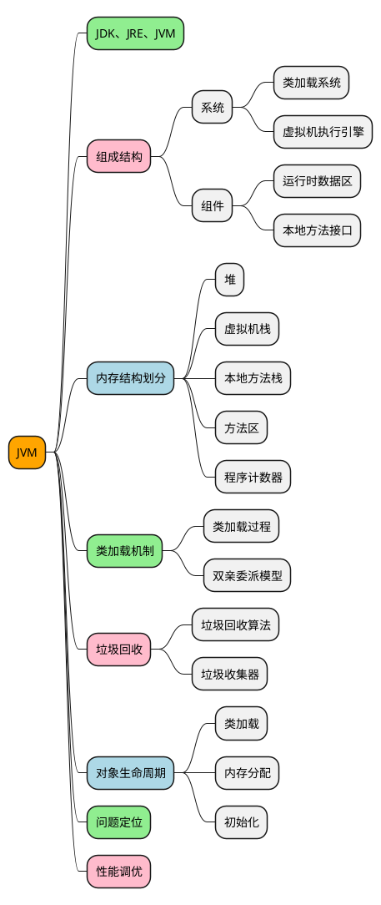
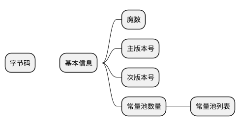

# 💻 Java 虚拟机
## 👁 概念总览



## ❓ 面试现场

### 🏖️ JDK, JRE, JVM

- JVM
  - Java 虚拟机编译 Java 源文件生成中间字节码问题
  - 加载解析字节码文件,调用系统相关 API 解释执行字节码数据流中对应的字节码指令
  - 为不同平台提供支持,使得 Java 语言的具有跨平台的特性
- JRE
  - Java Runtime Environment, 包括了 JVM 虚拟机的标准实现和相关类库
- JDK
  - Java Develop Kit, Java 开发工具套件, 包括了 JRE 运行时环境和相关的一些工具支持

### 🛠️ JDK 常用工具

#### jps

查看环境中运行的 java 进程

#### jinfo

配置信息: 环境属性, VM 启动参数

#### jstate

虚拟机状态监控

### 字节码规范

#### 字节码结构



### 虚拟机规范

### 类加载系统

#### 类加载过程

- 加载
  - 字节码解析
  - 符号引用和常量==>常量池中
  - Class 对象生成
- 链接
  - 验证
    - 文件格式校验
    - 元数据信息校验
    - 字节码校验
    - 符号引用校验
  - 准备
    - 初始化,赋零值
  - 解析
    - 类或接口信息解析
    - 字段属性解析
    - 类方法解析
    - 接口方法解析
    - 方法引用类型解析
    - 方法句柄解析
    - 动态调用解析
- 初始化
  - clint 方法

#### 双亲委派模型

#### 自定义类加载器

### ⚙️ JVM 内存结构

- 内存结构划分

  - 堆
    - 线程共享
    - 实例对象内存分配的地方
    - 内存管理的主要区域
      - 新生代
        - Eden
          - 分配比 默认 8:1:1
          - 对象多为瞬时对象
        - Survivor
          - From
          - To: 用于老年代和新生代交互的区域
    - OOM
  - 虚拟机栈
    - 线程私有
    - 方法执行的内存区域,基于栈帧进行调用,生命周期同方法
    - 组成
      - 操作数栈,栈帧进行数据处理操作所用的数据区域
      - 局部变量表: 方法中局部变量存储区域
      - 动态链接
      - 方法返回值地址(异常表)
  - 本地方法栈
    - JNDI 和本地其它语言支持的方法调用
  - 方法区
    - 类对象信息
    - 常量和静态变量
    - 类字节码信息
  - 程序计数器
    - 本地方法指向的为 undefined
    - 指向方法下一处调用的引用地址

- **JVM 内存结构划分**
  &emsp;&emsp;`JVM`内存主要有`虚拟机栈`、`本地方法栈`、`方法区`、`堆`和`程序计数器`五块,其中`虚拟机栈`、`本地方法栈`、`程序计数器`是线程私有的，而`堆`和`方法区`是线程共享的。

- **堆（Heap）**

  - 占用空间最大，Java 中垃圾回收主要区域，采用分代收集算法进行回收。
  - 主要存放线程共享的实例对象，几乎所有的实例独享都是在堆中存放的，随着技术更新，栈上分配、标量替换等优化技术使得对象不一定在堆上进行分配。
  - 堆区分了新生代和老年代，新生代又分为：Eden 空间、From Survivor（S0）空间、To Survivor（S1）空间

- **虚拟机栈（JVM Stacks）**

  - 线程私有，生命周期与线程相同
  - 栈帧(Stack Frame)是用于支持虚拟机进行方法调用和方法执行的数据结构
  - 存储了方法的局部变量表、操作数栈、动态连接和方法返回地址等信息

- **本地方法栈**

  - 本地方法栈是为虚拟机使用到的 Native 方法服务

- **程序计数器**

  - JVM 内存中占用空间最小的一块，同时也是线程私有的，它是唯一没有 OutOfMemoryError 异常的区域。
  - 程序计数器的作用可以看做是当前线程所执行的字节码的行号指示器，字节码解释器工作时就是通过改变计数器的值来选取下一条字节码指令。其中，分支、循环、跳转、异常处理、线程恢复等基础功能都需要依赖计数器来完成。
  - 为了线程切换后能恢复到正确的执行位置，每条线程都需要有一个独立的程序计数器，各条线程之间的计数器互不影响，独立存储，我们称这类内存区域为“线程私有”的内存。

- **方法区**
  - 方法区与堆有很多共性：线程共享、内存不连续、可扩展、可垃圾回收，同样当无法再扩展时会抛出 OutOfMemoryError 异常
  - 方法区中主要存储的是已被虚拟机加载的类信息、常量、静态变量、即时编译器编译后的代码等数据。

> [!NOTE]
> 可以参考：[JVM 内存结构](docs/principle/jvm/jvm-memory-structure)

### 👣 对象创建和内存分配

- 堆
  - Eden
    - TLAB
    - Eden 足够直接分配
    - MinGc
      - Eden S0 ==> S1 && S1 <==> S0
        - Major GC
          - Full GC
            - 堆 栈 方法区
- 栈

  - 逃逸分析: 局部变量作用域
  - 标量替换: 聚合量对象拆散为标量进行栈上分配

- 类初始化
  - new getstatic putstatic invokestatic
  - 反射
  - JNDI
- 对象创建
  - new
    - 类加载
    - 内存分配
      - 指针碰撞
      - 空闲列表
      - TLAB
    - 赋初始值 0 值
    - 构造方法: 初始化

### 内存管理

#### 内存分配

#### 内存回收

### 垃圾收集

#### 垃圾回收算法

#### 垃圾收集器

### 类与类加载器

&emsp;&emsp;jvm 中，确定一个类的唯一性是依赖于加载这个类的类加载器和这个类本身的。只有加载类的类加载器和类本身两者都一致，jvm 才会认为这个类是唯一的。

### 类加载器的分类

- JVM 层面分类

  - 启动类加载器（Bootstrap ClassLoader）,由 C++语言实现，属于 JVM 内部。
  - 其他的类加载器,由 java 语言编写，属于 JVM 外部，全部继承于抽象类 java.lang.ClassLoader

- Java 层面分类
  - 启动类加载器（Bootstrap ClassLoader）;
  - 扩展类加载器（Extension ClassLoader）:负责加载<JAVA_HOME>\lib\ext 目录中的，或者被 java.ext.dirs 系统变量所指定的路径下的类库。
  - 应用程序加载器（Application ClassLoader）:该加载器是 ClassLoader 中的 getSystemClassLoader()方法的返回值，一般也称为系统类加载器,负责加载用户类路径 CLASSPATH 所指定的类库。

### JVM 中类加载机制

&emsp;&emsp;JVM 中类的装载主要是由`ClassLoader`及其子类来实现的。<br>
&emsp;&emsp;`ClassLoader`是负责在运行时查找和装入类文件的类，

#### 双亲(父亲)委派机制

&emsp;&emsp;java 中存在 3 种类型的类加载器：引导类加载器，扩展类加载器和系统类加载器。三者是的关系是：引导类加载器是扩展类加载器的父类，扩展类加载器是系统类加载器的父类。

- **引导类加载器（Bootstrap）**<br>
  &emsp;&emsp;主要负责加载 jvm 自身所需要的类，该加载器由 C++实现，加载的是 <JAVA_HOME>/lib 下的 class 文件，或 -Xbootclasspath 参数指定的路径下的 jar 包加载到内存中，注意必由于虚拟机是按照文件名识别加载 jar 包的，如 rt.jar，如果文件名不被虚拟机识别，即使把 jar 包丢到 lib 目录下也是没有作用的(出于安全考虑，Bootstrap 启动类加载器只加载包名为 java、javax、sun 等开头的类。

- **拓展类加载器(Extension)**<br>
  &emsp;&emsp;扩展类加载器是指 Sun 公司(已被 Oracle 收购)实现的 sun.misc.Launcher\$ExtClassLoader 类，由 Java 语言实现的，是 Launcher 的静态内部类，它负责加载 <JAVA_HOME>/lib/ext 目录下或者由系统变量 -Djava.ext.dir 指定位路径中的类库，开发者可以直接使用标准扩展类加载器。

- **系统类加载器（Application）**<br>
  &emsp;&emsp;也称应用程序加载器是指 Sun 公司实现的 sun.misc.Launcher\$AppClassLoader 。它负责加载系统类路径 java -classpath 或 -D java.class.path 指定路径下的类库，也就是我们经常用到的 classpath 路径，开发者可以直接使用系统类加载器，一般情况下该类加载是程序中默认的类加载器，通过 ClassLoade.getSystemClassLoader() 方法可以获取到该类加载器

### 双亲委派模型的工作过程是

&emsp;&emsp;如果一个类加载器收到了类加载的请求，他首先不会自己去尝试加载这个类，而是把这个请求委派父类加载器去完成。每一个层次的类加载器都是如此，因此所有的加载请求最终都应该传送到顶层的启动类加载器中，只有当父加载器反馈自己无法完成这个请求（他的搜索范围中没有找到所需的类）时，子加载器才会尝试自己去加载。

### 为什么使用双亲委派机制

&emsp;&emsp;在 Java 的日常应用程序开发中，类的加载几乎是由上述 3 种类加载器相互配合执行的，在必要时，我们还可以自定义类加载器，需要注意的是，Java 虚拟机对 class 文件采用的是按需加载的方式，也就是说当需要使用该类时才会将它的 class 文件加载到内存生成 class 对象，而且加载某个类的 class 文件时，Java 虚拟机采用的是双亲委派模式即把请求交由父类处理，它一种任务委派模式。

- **JVM 中如何判断两个对象属于同一个类**
  - 用同名的类完成实例化的；
  - 两个实例各自对应的同名的类的加载器必须是同一个。比如两个相同名字的类，一个是用系统加载器加载的，一个扩展类加载器加载的，两个类生成的对象将被 jvm 认定为不同类型的对象。
- **目的**<br>
  &emsp;&emsp;防止重复加载同一个 .class 。通过委托去向上面问一问，加载过了，就不用再加载一遍。保证数据安全。
  &emsp;&emsp;为了系统类的安全，类似“ java.lang.Object”这种核心类，jvm 需要保证他们生成的对象都会被认定为同一种类型。即“通过代理模式，对于 Java 核心库的类的加载工作由引导类加载器来统一完成，保证了 Java 应用所使用的都是同一个版本的 Java 核心库的类，是互相兼容的”。<br>
  &emsp;&emsp;保证核心 .class 不能被篡改。通过委托方式，不会去篡改核心 .clas ，即使篡改也不会去加载，即使加载也不会是同一个 .class 对象了。不同的加载器加载同一个 .class 也不是同一个 Class 对象。这样保证了 Class 执行安全。

### 类加载器和双亲委派模式的关系

首先我们来看看如果不用双亲委派模式，会是什么结果。比如我们自己创建了一个 java.lang.Object 类，并且放在 classpath 下，然后启动程序，因为 java 本身会有个 java.lang.Object 类，然后会造成 java 本身的 Object 类由启动类加载器来加载，而我们自己创建的 Object 类会由应用程序类加载器类加载，然后根据我们前面提到的【一个类的唯一性由加载这个类的类加载器和这个类本身来确定】，那么现在这种情况，就会造成类的混乱。而使用双亲委派模式的话，会进行限制，这种情况如果我们自己创建了一个 java.lang.Object 类，则会在运行时发生错误，限制了类混乱的问题。

### `Class.forName(String className)`和`ClassLoader.loadClass(String name)`的区别.

&emsp;&emsp;这两种方式都可以进行类的加载，并且都遵循了`双亲委派`机制，区别在于`forName()`默认会进行类的初始化操作，进行静态变量的负责和静态代码块的执行；
&emsp;&emsp;`loadClass()`只进行了类的加载，未进行初始化操作，在使用类的时候才进行初始化操作，加载静态变量和静态代码块。

### 问题总结

#### 如何自己写一个 java.lang.System 类？

&emsp;&emsp;为了不让我们写 System 类，类加载采用委托机制，这样可以保证爸爸们优先，爸爸们能找到的类，儿子就没有机会加载。而 System 类是 Bootstrap 加载器加载的，就算自己重写，也总是使用 Java 系统提供的 System，自己写的 System 类根本没有机会得到加载。<br>
&emsp;&emsp;但是，我们可以自己定义一个类加载器来达到这个目的，为了避免双亲委托机制，这个类加载器也必须是特殊的。由于系统自带的三个类加载器都加载特定目录下的类，如果我们自己的类加载器加载一个特殊的目录，那么系统的加载器就无法加载，也就是最终还是由我们自己的加载器加载。
扩展点：
java 提供了 endorsed 技术，可以覆盖 jdk 中的某些类，具体做法是….。但是，能够被覆盖的类是有限制范围，反正不包括 java.lang 这样的包中的类<br>
参考 Tomcat 的`Bootstrap`类

## GC-垃圾回收

&emsp;&emsp;Java 语言中一个显著的特点就是引入了垃圾回收机制，使 c++程序员最头疼的内存管理的问题迎刃而解，它使得 Java 程序员在编写程序的时候不再需要考虑内存管理。由于有个垃圾回收机制，Java 中的对象不再有"作用域"的概念，只有对象的引用才有"作用域"。垃圾回收可以有效的防止内存泄露，有效的使用可以使用的内存。<br>
&emsp;&emsp;回收机制有分代复制垃圾回收和标记垃圾回收，增量垃圾回收。

### 垃圾回收算法

- 复制清除
  - 担保空间
- 标记清除
  - 内存碎片
- 标记整理
  - 效率低
- 分代回收
  - 年轻代 复制清除
  - 老年代 标记清除/标记整理

### 对象存活判断

- 引用计数
  - 循环引用
- 可达性分析
  - Gc Root
    - 局部变量表
    - 静态变量
    - 常量
- Gc 年龄
  - 默认 15 会进入老年代
  - 相同年龄对象占一半,大于等于此年龄的到老年代
  - 大对象配置直接到老年代分配内存
  - Eden 和 Survivor 配比 8:1:1

### 垃圾回收期

- 年轻代
  - Serial
    - 单线程 Stop The World 暂停其它工作线程
  - ParNew
    - 并行的 Serial
  - Parallel Scavenge
    - 可配置 GcTimeRatio MaxGcPauseMills
    - 关注系统吞吐量 ==> 加速比
- 老年代
  - CMS
    - 标记清除 内存碎片配置化进行整理
    - 最短 GC 停顿时间
      过程 - 初始标记 - 并发标记 - 重新标记 - 并发清除
    - 关注吞吐量
  - Serial Old
  - Parallel Old
  - G1
    - 并行并发
    - 分代收集
    - 标记整理
    - 可预测停顿
    - 关注响应速度

### 垃圾回收器的基本原理是什么？垃圾回收器可以马上回收内存吗？有什么办法主动通知虚拟机进行垃圾回收？

对于 GC 来说，当程序员创建对象时，GC 就开始监控这个对象的地址、大小以及使用情况。通常，GC 采用有向图的方式记录和管理堆(heap)中的所有对象。通过这种方式确定哪些对象是"可达的"，哪些对象是"不可达的"。当 GC 确定一些对象为"不可达"时，GC 就有责任回收这些内存空间。可以。程序员可以手动执行 System.gc()，通知 GC 运行，但是 Java 语言规范并不保证 GC 一定会执行。

### java 中会存在内存泄漏吗，请简单描述

所谓内存泄露就是指一个不再被程序使用的对象或变量一直被占据在内存中。java 中有垃圾回收机制，它可以保证一对象不再被引用的时候，即对象编程了孤儿的时候，对象将自动被垃圾回收器从内存中清除掉。由于 Java 使用有向图的方式进行垃圾回收管理，可以消除引用循环的问题，例如有两个对象，相互引用，只要它们和根进程不可达的，那么 GC 也是可以回收它们的，例如下面的代码可以看到这种情况的内存回收：

### 对象在内存存中结构
对象在内存中存储的布局可以分为三块区域：对象头（Header）、实例数据（Instance Data）和对齐填充（Padding）。
HotSpot虚拟机中第一部分用于存储对象自身的运行时数据， 如哈希码（HashCode）、GC分代年龄、锁状态标志、线程持有的锁、偏向线程ID、偏向时间戳等等，这部分数据的长度在32位和64位的虚拟机（暂 不考虑开启压缩指针的场景）中分别为32个和64个Bits，官方称它为“Mark Word”。
- 锁标志位
  - 01 无锁/偏向锁
  - 00 轻量锁
  - 10 重量锁
  - 11 GC年龄

  锁的状态总共有四种：无锁状态、偏向锁、轻量级锁和重量级锁。随着锁的竞争，锁可以从偏向锁升级到轻量级锁，再升级的重量级锁（但是锁的升级是单向的，也就是说只能从低到高升级，不会出现锁的降级）。JDK 1.6中默认是开启偏向锁和轻量级锁的，我们也可以通过-XX:-UseBiasedLocking来禁用偏向锁


### 锁升级
同步-> 轻量锁 -> MarkWorld复制到栈帧中 -> 设置锁记录指针 -> 成功 -> MarkDown设置为轻量锁
                                                      -> 失败 -> 锁重入判断 -> 重入
                                                                           -> CAS 竞争锁 -> 锁升级为重量锁(自旋等待)
偏向锁: 无锁编程避免轻量锁的性能损耗
  - 撤销: 偏向锁只有遇到其他线程尝试竞争偏向锁时，持有偏向锁的线程才会释放锁，线程不会主动去释放偏向锁。偏向锁的撤销，需要等待全局安全点（在这个时间点上没有字节码正在执行），它会首先暂停拥有偏向锁的线程，判断锁对象是否处于被锁定状态，撤销偏向锁后恢复到未锁定（标志位为“01”）或轻量级锁（标志位为“00”）的状态

- 安全点
  - GC StopTheWord
  - 偏向锁释放


## JVM 虚拟机

&emsp;&emsp;`JVM（Java Virtual Machine）`虚拟机是一个应用程序，提供了运行 Java 程序所需的运行时环境。如果某个硬件和操作系统平台没有相应的 JVM，就不能运行 Java 程序。<br>
&emsp;&emsp;执行`java <arguments> <program name>` 命令会在操作系统的一个进程中启动 JVM。

- `JVM`虚拟机提供了什么用处？
  1. 提供一个容器，让应用程序代码运行在其中；
  2. 较`C/C++`，提供了一个安全的执行环境；
  3. 帮助代开发者管理内存；
  4. 提供一个跨平台的执行环境;
  5. JVM 使用运行时信息进行自我管理。

### 运行在`JVM`中的语言

&emsp;&emsp;理论上，`JVM`虚拟机能运行任何有效的类文件，除了 Java 程序能运行在`JVM`虚拟机中，像`Groovy`、`Scala`、`Kotlin`、`Clojure`等也都可以运行在`JVM`虚拟机中。

- 其它语言在`JVM`中的运行方式，主要通过两种方式运行。
  1. 第一种，提供用于生成类文件的源码编译器（类似于 javac），以类似 Java 代码的方式在 JVM 中运行（Scala 等语言采用的是这种方式）。
  2. 第二种可以使用 Java 实现解释器和运行时，然后解释该语言使用的源码格式。JRuby 等语言采用的就是这种方式。

## Java 程序生命周期

&emsp;&emsp;Java 程序的生命周期首先从 Java 源码开始的，通过`javac`编译后转换为字节码文件（.class），再经过`JVM`虚拟机中的解释器将字节码解释为机器码运行。

### 字节码是什么？

&emsp;&emsp;Java 中的 **字节码** 是以`.class`结尾的特殊的类文件。是处于 **源码** 和 **机器码** 之间的`中间表现形式`。通过`javac`编译器将 **源码** 编译为 **字节码**，再提供给`JVM`虚拟机进行高效解释执行。<br>
&emsp;&emsp;**字节码** 是与设备无关的，不管哪种设备，生成的字节码都是一样的，其中也包括设备使用的字节顺序。

### 操作码（指令码）是什么？

&emsp;&emsp;指令码（操作码）只占一个字节（有些操作还可以有参数，即跟随其后的字节流），所以只有 256 个可用的指令。实际上，有些指令用不到，大概只会使用 200 个，而且其中还有一些是最新版 javac 不支持的。

### `javac`是编译器吗？

&emsp;&emsp;**编译器** 一般指的是将源码进行编译生成机器码，而`javac`并不算完整的编译器，只是将 java 源码编译为中间文件 `字节码`，再由`JVM`虚拟机中的解释器（JIT）进一步编译成机器码进行解释执行。

- 在 Java 语言中将编译分为两部分，分别为`前端编译` 和 `后端编译`。
  1. **前端编译**：将源码编译为`字节码`文件。`javac`执行的就是这一步操作，又称为 `源码编译`。
  2. **后端编译**：将 `字节码` 进一步编译成机器码，进行解释执行。`JVM`虚拟机中的解释器（JIT）就是执行的这一步操作。

### Java 语言是解释性语言吗？

- 什么是解释性语言？<br>
  &emsp;&emsp;我们都知道计算机只能理解机器语言，而高级语言编写的程序若要被计算机进行执行，必须要先将高级语言翻译为机器语言，再由计算机进行执行，而翻译的形式一般有两种：`解释` 和 `编译`。<br>
  &emsp;&emsp;在 Java 语言中，`JVM`虚拟机基本上算是解释器（JIT 编译大大提升了性能）。而`JVM`解释执行的是`字节码`，需要先用`javac`将源码编译为`字节码`。因此，可以看出 Java 并不完全算是解释性语言。<br>
  &emsp;&emsp;常见的解释性语言有`python`、`javascript`等，在程序运行时，边解释边执行，执行效率较低，而且解释性语言的运行结果可能会受到环境的影响（比如`python2`和`python3`）。

## 参考资料

### 常见面试题指南 :id=interview-question-guide

```pdf
/technology/jvm/jvm-interview-question-guide.pdf
```
